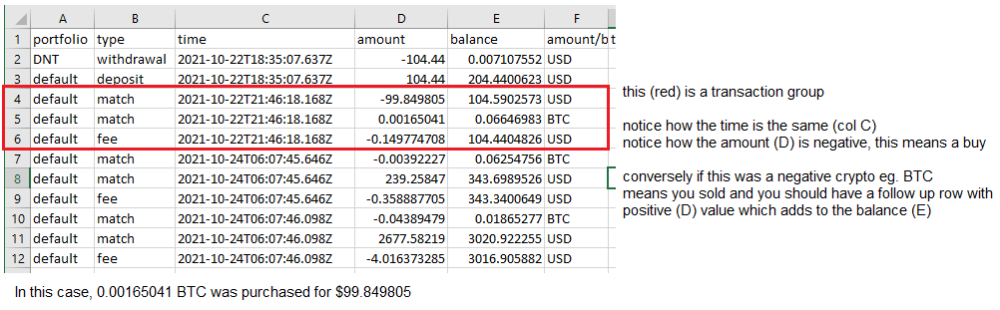

# Status: Functional

(node only, no UI, does not factor in withdrawal/transfers)

### About

This is an unfinished parser that takes a CBP account CSV dump of all portfolios and outputs a CSV that can be uploaded into Turbotax for buy/sell gains/losses see an example of what that CSV would look like below.

```
Currency Name	Purchase Date	Cost Basis Date Sold	 Proceeds
BTC	          01/20/2022	  $100	     01/25/2022 -$50
```

This needs to factor in the cost of deposits and similarly withdrawals.

That's why this is not an easy thing to make.

I was aiming to make this all completely client side but if you need to look up any transfers/withdrawals then you would need an API key for CBP.

As I write this, this is the last day to file taxes so I'm not interested in making this functional right now.

I'm also in general done screwing around with crypto other than having some just because.

### Parsing logic



Line 10 is an example of a sale.

### Code entry point

`standalone-parser/index.js` (only file used)

This is using nodeJS to read and step through/parse the CSVs.

If you bought crypto in the year prior to current tax year and sold them in the current tax year, you'll have to parse that CSV first, store in JS state to subtract with sales in current tax year.

There is a front-end but not finished/schemas no longer match so it's broken.
