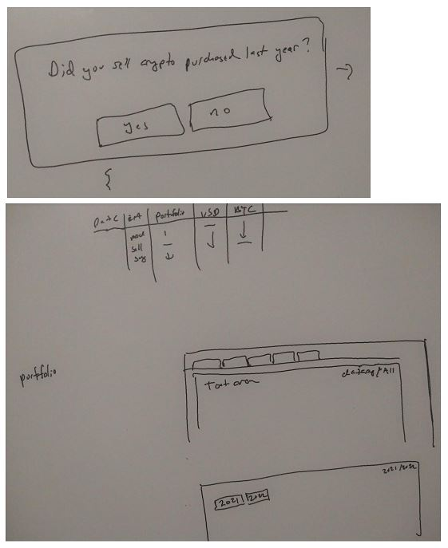
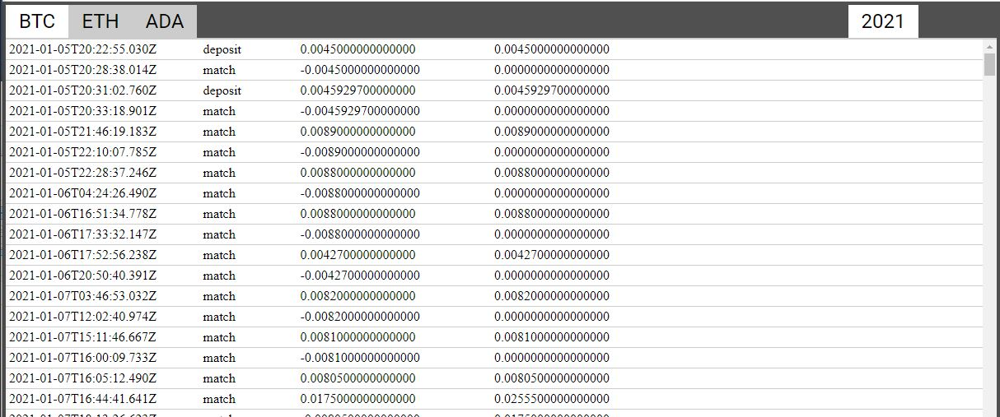
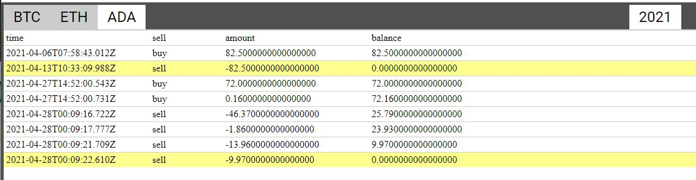

### 04/16/2023

5:07 PM

wtf... this is not on purpose (same time as yesterday)

I actually slept like 3 hours so I should get back onto a normal sleep pattern

going to work on this again, I have to get this done/file my 2022 taxes

I've been stuck/dreading this part

I have to regroup the original data by transaction time, then if it's not a deposit/withdrawal figure out the cost basis of the currency so I can determine gains from buy/sell following FIFO

I don't feel great but will move forward

- [ ] get cost basis for buy/sale

there is a pattern, match match fee

6:08 PM

ahh man... I thought I had it... here's an edge case where different portfolios execute at the same time

```
Shorts	match	2021-01-22T19:38:57.796Z	-127.3	  146.6637925	USD
default	match	2021-01-22T19:38:57.796Z	-77.05	  2.332368061	USD
Shorts	match	2021-01-22T19:38:57.796Z	0.0038	  0.03515	    BTC
default	match	2021-01-22T19:38:57.796Z	0.0023	  0.06202005	BTC
default	fee	  2021-01-22T19:38:57.796Z	-0.269675	2.062693061	USD
Shorts	fee	  2021-01-22T19:38:57.796Z	-0.44555	146.2182425	USD
```

That f's up my previous 3 group logic

Concern is... I could group by portfolio under the date group... I could also just group these transactions together since they occurred at the same time

I'll try that (portfolio group under date) vs. combine


---

### 04/15/2023

5:07 PM

Okay my sleep pattern is still mega f'd just woke up

But I need to get this done today

I have to group the portfolios together, didn't think about that yesterday

and detect if transferring to/from portfolios and make sure it all balances out

6:09 PM

this is tough... my mind just feels overwhelmed

I could try charting... since that would show me where stuff goes up/down...

Still working on the grouping though

6:24 PM

need to start simple (few rows), check the math

6:47 PM

one issue is there are so many transactions... can't display them on a page using `divs`

Either use textarea or something else... canvas maybe or svg but I don't know how to do that currently

The whole point of what I'm trying to do is figure out the cost basis of any crypto I had left over from 2021 that I used in 2022.

In the end what I would do is make a table that can be copy/pasted into a CSV for output...

I don't think I can generate a CSV on client side, maybe.

Damn it is possible

https://stackoverflow.com/a/14966131/2710227

I think what I can do is find the most recent (closest to 2022) where my BTC balance hit 0

In 2021 I only messed around with BTC, ETH, ADA

I had some ETH in 2022 so I had left over balance with that from 2021

No ADA in 2022 so this one don't have to worry about... it's good that you can see it hit 0 in the spreadsheet, source of truth

I'm close Margo...

I'm thinking... a tabbed interface, of each currency, then you see the history (in a textarea)

Maybe a tool to find most recent 0 balance to start from

man... this project is like an insurmountable thing... I'm close, I've got it all "loaded in my ram" (brain) so to speak

close to coming up with something that makes sense/useful

I can manually step through it based on the most recent 0 balance of a currency as a starting point which would cut off a huge chunk of the spreadsheet to go through...

but having it automated is nice and verifiable regarding accuracy

7:05 PM

hmm.... I was trying not to use React for this project but might as well

Helps for producing UIs

7:12 PM

I could exclude fees automatically (some toggle) to reduce displayed rows

Also thought of infinite scroll type deal with empty placeholders above for performance but it's all just text idk...

Ahh damn I do need a temporary API till I'm using the drag-drop file reader

7:48 PM

I am aware that I need to not worry about finishing this app and worry about getting my taxes done ha

I've been procrastinating on this because it's such a big thing to do for me correctly parsing the thousands of rows in these two spreadsheets.

Quick insights would be good, click a tab and see if it has any left over in this year

two tabs/hierarchy: year, currency

portfolio is inside each currency... not sure if that's a good design, I need to see things happen in order timewise

Yeah... I may just skip this all and get the job done... my mind is getting crappier and crappier over time

I have till Monday I'd say, Tuesday

rough ideas/designs



I don't want to build this app, but I think I need to in order to do this parsing/tracing of past transactions

8:20 PM

Gondor calls for aid (Metallica)

Time to force myself into the zone, autozone

Actually I'll listen to Korn, let's goooooo

This is the thing I have to do today

Reeeee Spotify's UI design changed

I did realize grouping by portfolio is not a good idea (need to do year -> currency) for FIFO

Although there is the matter of selling what's in the portfolio vs. selling it somewhere else unless transferred

9:33 PM

It's funny I pretty much just made a spreadsheet in the web so far



9:42 PM

Here you can see how zero-balance highlighting is helpful to figure out where to start the FIFO


I need to add a checkbox for every row, they're all selected by defualt, then uncheck/pick the ones to keep... a good way would be to make assumptions, like click at 500 row and keep the rest after that, or stop at this row 700, out of 1100 or something

Damn... what's hard is the dollars used for the transaction are after...

That would have to be preparsed so it shows up here in render as a column cost

9:54 PM

this one is good, all were sold in this year, none carried over into next year



Damn great song All Nightmare Long, like these f'n crypto transactions and floating point precision

10:05

Damn... it is about order obviously... but yeah

If you buy, USD is tracked first, if you sell the crypto currency is tracked first...

10:10 PM

Okay so I think I'll leave the current parser as is.

Since I need to select where to start (previous year)

Then it'll just build a new state in the web app

10:16 PM

... hmm Idk, I think I do have to preparse the cost

oh... the timestamps are grouped together (same)... so buy/sell the timestamps lineup

Damn... I organized this wrong, I'll have to break the current parse flow

I'll have to group by timestamp first, then group by currency, all the while keeping track of costs

10:37 PM

damn starting to feel spent, once I eat I'm pretty much f'd so need to get the main stuff done now

11:13 PM

got sidetracked, will see about continuing

---

### 04/14/2023

I have been procrastinating on this (and job searching/interviewing)

This has stopped me from completing my taxes since I need to track all these... this year I did at least 3000 trades... damn

I did consider another service despite the cost... but I don't have all portfolio API access... but the CBP account dump has every transaction, so that's what I'm parsing here

First I'm trying to visualize stuff... find where I hit 0 in 2021 and then start buying for FIFO that's used in 2022

So far my thought is to append columns by currency name, and then tally up the rows

I have to import each year, as separate objects in localStorage to work with if doing a SPA deal

4:39 PM

yeah like this

```
[
  'USD',  'BTC',  'ETH',
  'TRU',  'DNT',  'AMP',
  'LOOM', 'BLZ',  'SPELL',
  'XYO',  'ANKR', 'MDT'
]
```

man this lost money too I only put $500 in but yeah lost like 60% of it or something can't remember.

It's actually a good thing right now that I lost this since it will reduce the amount of tax I have to pay since I have no income right now

I lost between $3-4K in crypto (when BTC was in high $60K price and dropped to $20K)

Same for Astra damn... lost money there, ASTR lost at least 80% of it's value, was brutal

I'm still bagholding there but not sure if they'll be able to turn around since they've been under $0.50 for a couple months now

5:08 PM

I've also donated to a few places yearly so that'll help me with reducing what I owe in taxes

I owe because of freelancing for half a year... sucks I paid my W2 wages in advance I think highest option as a single person and I still owe taxes lol damn

5:15 PM

man this is tough... tracking where it went, keeping it all correct

I could try charting... to see where I stopped because I did get to a point where I didn't do anything with crypto for a bit

5:21 PM

I'm looking for general rules

- if the amount and balance rows are equal, means this portfolio/event had 0 balance starting out

5:51 PM

I'm not really being productive since I slept poorly but using `currency.js` seems to help with regard to rounding problems

the other issue is keeping track of where stuff goes in what portfolio and FIFO order of transactions

---

### 04/05/2023

I'm reminded of what good code is when I work on my old code and I want to scream lmao.

Will I do it again (write fast code to get it done, but unmaintainable)
