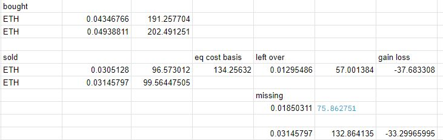
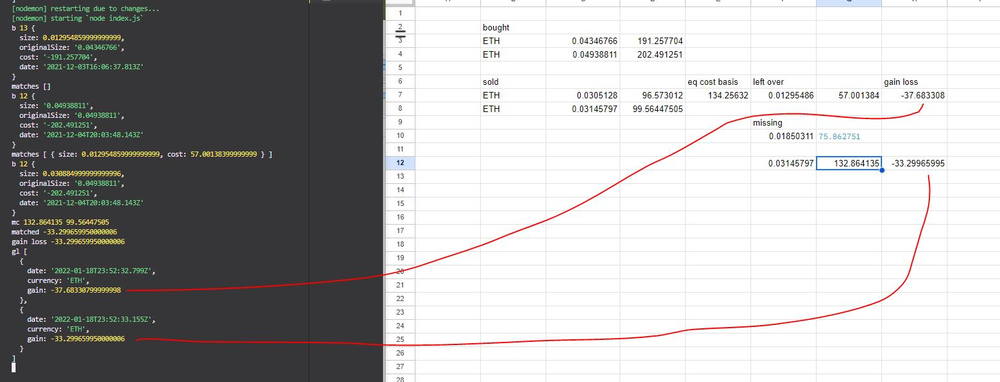
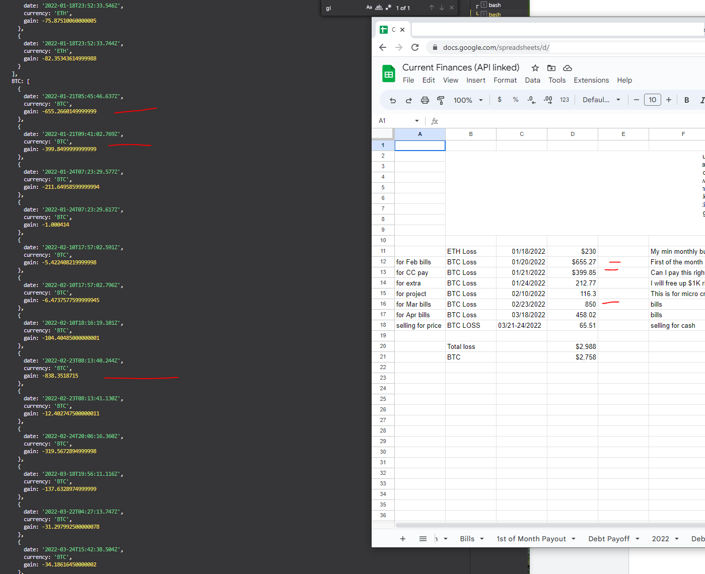
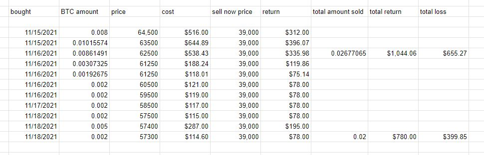
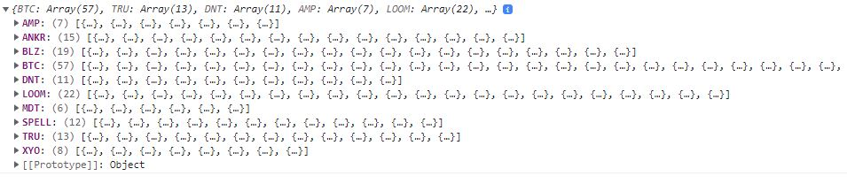
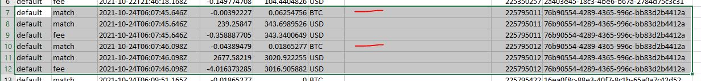
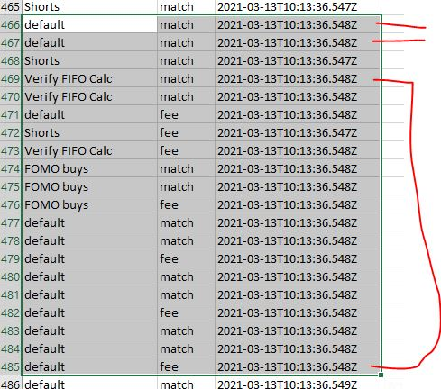
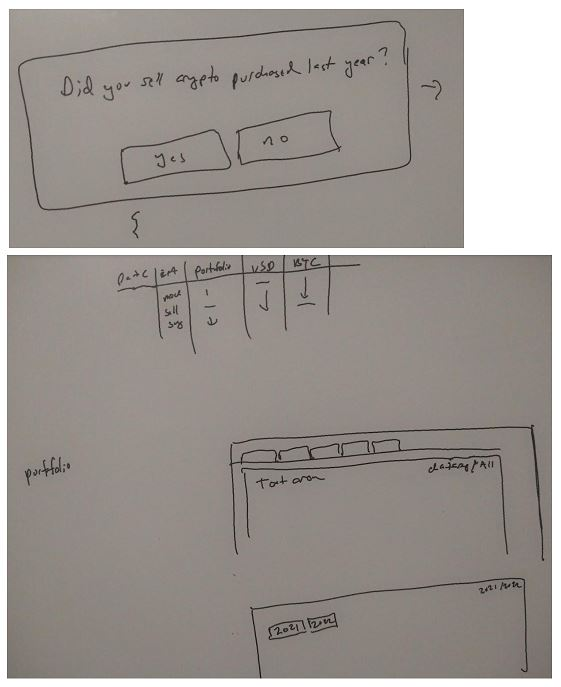
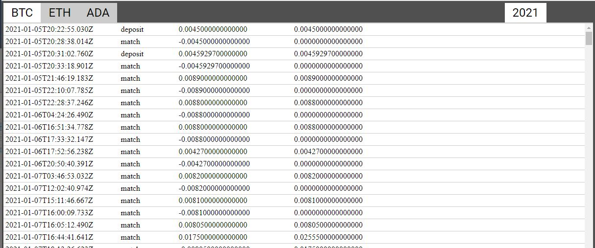
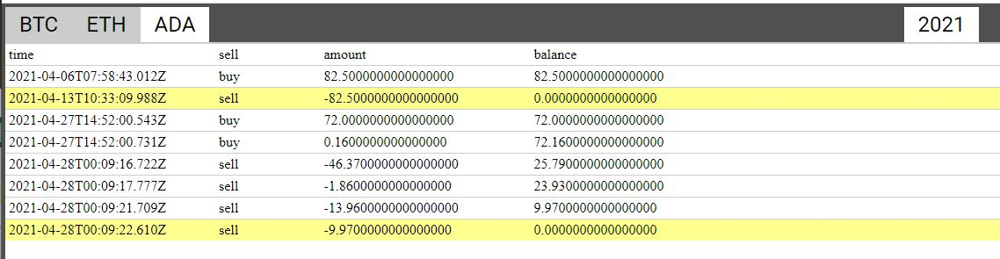

### 04/19/2023

4:03 PM

man... my sleep pattern is still f'd

I can't reset it, keep trying

I'm also like super f'd finance wise might be homeless lmao

4:10 PM

I need to really dumb this down for myself

I got semi-good sleep today so I can think

- loop over sells
- matching holder
  - this gets filled up by part of/several buys to match sale amount
  - remove used buy rows
- next iteration

seems simple

4:15 PM

alright let's go

start from blank slate again

4:23 PM

distracted...

4:27 PM

I usually listen to music to get in the zone but times like these when I really need to focus, have to be in silence

4:35 PM

omg Jacob focus

I keep looking at news articles

4:51 PM

going in circles struggling damn, weak brain

5:10 PM

here is an example of filling in remainder/cost basis, determining gain/loss



This is how I know that it's working before I accept the output of the full loop.

So far I don't have it working.

in Dec 03 2021, ETH was around $4373.72 and in Jan 18 2022 it was worth around 3,166.07

so yeah lost about 28% of its value

5:56 PM

alright... this is looking good



6:07 PM

holy crap I think it's right... haha nice



damn this was rough... I bought this with credit card money too = more losses oof

that's why I'm poor

6:13 PM

so... I have to average I guess the date purchased... then produce the spreadsheet that can be imported into turbotax

6:48 PM

I started to break apart the sales to log each buy... but got lost need to try again

this is hard, I have to load up this app's state/flow into my mind and keep it to work on it

I pushed up the the `tmp` branch of my attempt but screwed up

went back to here working code

7:03 PM

it checks out still with the broken out sales

ex.

```
sale date 2022-01-18T23:52:32.799Z
{
  size: 0.0305128,
  cost: 134.25632,
  buyDate: '2021-12-03T16:06:37.813Z',
  saleAmount: 96.573012
}
sale date 2022-01-18T23:52:33.155Z
{
  size: 0.012954859999999999,
  cost: 57.00138399999999,
  buyDate: '2021-12-03T16:06:37.813Z',
  saleAmount: 41.002131899999995
}
{
  size: 0.018503110000000003,
  cost: 75.86275100000002,
  buyDate: '2021-12-04T20:03:48.143Z',
  saleAmount: 58.562343150000004
}
```

now I'll produce the spreadsheet

7:14 PM

okay I got it done... individual buy/sales

I tracked this stuff before during the time



You can see why I lost so much ha "$100K" that was going around


---

### 04/18/2023

5:38 PM

okay... today is the final day I need to get this done

I'm feeling spent... didn't sleep well, drove two hours for an in-person interview

let's go... I've got buy/sell groups, now I need to loop through the sales against the buys (added up to match quantity sold, with average cost basis)

ugh what's annoying when I'm tired/late in the day, my damn hands/fingers won't stop sweating, getting my keyboard feeling gross

6:09 PM

huh... that was interesting, after I updated the crop data, there are no sales... for 2021 remainder

that would make sense since I am not caring about sales that happened in 2021, I just care about what is left over for 2022 to sell

so I'll need to double check this (against OG 2021) and then store the buys to be used with the other file... I'll probably just do a JSON file.

6:13 PM

let me verify 2021 crop one more time

ETH hit 0 at 169724615 2021-10-22T18:30:33.029Z (correct)

BTC hit 0 at 236043807 2021-11-15T00:33:06.084Z (correct)

okay so I'll output the data as importable JSON.

alright switching to year 2022

I will read the JSON prev buys file and set it as starting group

yeah... I remember this "let me trade a bunch of random currencies" then it all tanked and they all lost like 60% of value hilarious



6:27 PM

oh man... this is the hard part... the summing bit

6:31 PM

I've built this before... the issue is the rounding, but now we have currency.js

example 1:

sold 0.0305128000000000 of ETH with proceed of $96.5730120000000000 look at this decimal lmfao why is it so long... damn forgot my sigfigs days

is the first ETH buy row, at least that much?

0.04346766 ETH purchased for $191.257704 at 2021-12-03...

So there will be some left over from this purchase, you subtract it out of the "bucket" so to speak

...but it can be a recursive deal until the amount is met or while loop anyway.

6:42 PM

boy is getting distracted come on, finish it, put an end to this misery (until next year lmao) that's a good problem to have, means I survived my current problem (no job)

6:46 PM reee my hands and keyboard

what do I do here... I need to try some multiplication with currency.js

the issue is you have to split this thing up... fraction

the above, you have `0.04346766 - 0.0305128`

6:49 PM

what does the loop look like?

- is the amount sold > buy row
  - no (easy, just subtract, keep remaining buy)
  - yes (needs looping to build up/match)

7:17 PM

omg I'm getting distracted

7:23 PM

got the basic one where the sale is against 1 buy row

hard part is the recursive/sum up

there's a freaking bag pipe playing somewhere in my neighborhood lol

so I'm thinking... I keep the row that was subtracted against... or no

amazing grace lol

7:30 PM

Jimmy Neutron takes a hit of spraypaint, brain blast! sitting under a bridge homeless

I will take the remaining buy and subtract from the sale... and then keep going...

I think that's the self-calling loop

7:35 PM

oh yeah... I remember now why this is hard... because you'll get scenarios where it's 9999999999 and it won't "empty" the bucket

so it never gets past it

- use remaining buy row
- keep going until current sell is matched

7:52 PM

losing focus, I have to finish this today... TODAY

or else I'm f'd and kicking the problem down the road

I can do it...

8:08 PM

I can't fail

8:11 PM

ooh... caffeine at this time not good

I just remembere this song...

(some weird creature rustling in the woods)

(muffled) nobody gonna break my stride

(getting louder) NOBODY GONNA SLOWWWW ME DOWN... OH NO!

come up with the algo you pos come on

8:21 PM

man I'm blanking this is bad

8:33 PM

I'm struggling stuck on this

8:39 PM

I am thinking of changing my approach

I will have a floating buy which will match the size of the sale

It will subtract buy row(s) in ascending order from the buy stack

until it has enough to meet the sale

8:47 PM

oh man this is bad, I'm so spent I can't think

I still have time (12 AM deadline) but yeah...

8:54 PM

this ain't happening... I'll be late by a day

I will sleep and do this with a fresh mind

---

### 04/17/2023

2:33 PM

ahh man... supposed to be studying right now but this is still not done, have to file today

2:49 PM

I need to get this done... starting over the looping again

- sort by date ascending
- group by portfolio (only because of random order)
- group into cost basis blocks for sell subtraction

Alright accountability... by time

3:00 PM

3:07 PM

a problem is the deposits... where did they come from, how much were these units?

at least in 2021 any transfers were used by the last time BTC hit 0

row 2837 is last time ETH hits 0

advance to 2840 which is after that transaction (3 row group match match fee)

3082 is where BTC was at 0

3:22 PM

Okay I cut down the 2021 spreadsheet to only include what went into 2022

3:25 PM

ahh man there are 3 deposits still... so I'll have to use CBP API to figure out where these came from... it's probable they're just from a portfolio

oh no was not loading the right one... 2022 has em though

... maybe not

okay thankfully there are no deposits after 0 balance, none in 2021 crop and none in 2022 so that makes things easier

I can just count up as things happen

3:34 PM

I need to take a quick break

I will get this done, even if I manually do it in small chunks

4:00 PM

back on

4:35 PM

making some progress

4:55 PM

distracted but starting the buy/sell groups

5:00 PM

Oh man... this was a good catch

these partial events under same `orderId` ugh... need to check that



I don't know... I was trying to make sure the rows were in order since there was a case where the time was out of order... but maybe the match, match, fee rows were not out of order

Looking at this image though, the trade id is a better way to group

5:29 PM

losing focus

I think the order of the match, match, fee has to be guaranteed due to cause/effect... you either lose money (buy) or lose crypto (sell), which affect the opposite.

5:48 PM

oh man... the iso date sorting doesn't work

6:00 PM

no it is working...

6:07 PM

there are no cases where a first row, USD is greater than 0

as in the event... if it's a gain, you see the crypto currency as first row

it seems like that is honored

6:11 PM

I think this is guaranteed the event then cost/fee order for match, match, fee

6:18 PM

it was my trade Id object... I should use map

wtf... it's still wrong

6:23 PM

oh map isn't used like an object

6:30 PM

oh man... now it's correct

6:44 PM

I still have more multiple zero BTC rows

247, 236216268 started buying again

351

188034937 ETH first row no 0

hits 0 here 97133362

I have 5 hours left to get this done... less than that to finish the rest of it/file

technically I also have tomorrow too to do this

April 18 at midnight

I do have to stop to study but I can still go some more

6:52 PM

So right now I have buy/sell groups for 2021... which I have to process in order to determine how much I have left (cost basis) that goes into 2022.

I'll work till 8

6:58 PM

I have to remember how this works the cost basis

- have to combine buys if less than what was sold
- average the cost basis of these
- determine gain/loss

Oh yeah I think I remember now how I did this

Looped over sales, and met the sale amount by adding buys (removing from buy array as they are used)

Then tracking the sales along with what is left after all sales are done

7:22 PM

yeah I feel spent already damn, I've made progress though

---

### 04/16/2023

5:07 PM

wtf... this is not on purpose (same time as yesterday)

I actually slept like 3 hours so I should get back onto a normal sleep pattern

going to work on this again, I have to get this done/file my 2022 taxes

I've been stuck/dreading this part

I have to regroup the original data by transaction time, then if it's not a deposit/withdrawal figure out the cost basis of the currency so I can determine gains from buy/sell following FIFO

I don't feel great but will move forward

- [ ] get cost basis for buy/sale

there is a pattern, match match fee

6:08 PM

ahh man... I thought I had it... here's an edge case where different portfolios execute at the same time

```
Shorts	match	2021-01-22T19:38:57.796Z	-127.3	  146.6637925	USD
default	match	2021-01-22T19:38:57.796Z	-77.05	  2.332368061	USD
Shorts	match	2021-01-22T19:38:57.796Z	0.0038	  0.03515	    BTC
default	match	2021-01-22T19:38:57.796Z	0.0023	  0.06202005	BTC
default	fee	  2021-01-22T19:38:57.796Z	-0.269675	2.062693061	USD
Shorts	fee	  2021-01-22T19:38:57.796Z	-0.44555	146.2182425	USD
```

That f's up my previous 3 group logic

Concern is... I could group by portfolio under the date group... I could also just group these transactions together since they occurred at the same time

I'll try that (portfolio group under date) vs. combine

6:23 PM

I need to get this done today... so I'm going to skip the front end stuff and just do it with an API

I know where the previous year ended with regard to how much BTC/ETH I had...

- [ ] verify left over crypto from 2021
- [ ] find cost basis for amount crypto from 2021
- [ ] process 2022 transactions

I have to get this done today, since I have to study for an interview

6:33 PM

Okay for 2021... I will tally up the events and if the balance of a cryptocurrency hits 0, start over with regard to counting cost basis

I will not factor in portfolio other than matching values (due to non-guaranteed order)

6:40 PM

holy crap look at this one, 18 groups



6:48 PM

omg... I just realized the balance of a currency eg. BTC could be 0 but only in a portfolio, has balances elsewhere... damn

which againt portfolio is not supposed to be part of it... it's all part of CBP, the only place I use to screw around with crypto...

okay... so I think I will still do a grouping of time -> portfolio

but when processing I'll use time for FIFO no matter what portfolio it comes from since cost basis will be a shared thing... common

the buys will be stored in arrays by amount and cost... that'll be used to figure out FIFO gain/loss

ahh damn... I also forgot object keys are not guaranteed in order

I think I need to sort the time column first before going through it

7:05 PM

ugh... this is where my brain falls short, I feel overwhelmed brain shuts down

I don't know why I didn't think about date order before till I saw that the spreadsheet's order is not guaranteed

7:23 PM

I did have a thought (ooh do tell) if my math is right, then I should be able to verify it against the balance tracked in the spreadsheet

the ultimate goal is to produce a spreadsheet like this

```
Currency Name	Purchase Date	Cost Basis Date Sold	 Proceeds
BTC	          01/20/2022	  $100	     01/25/2022 -$50
```

which yeah... I lost more than $3K last year in crypto lmao dumbass

but it's good now since I have no income to pay owed taxes so any reductions like losses or donations helps me

I also paid $3K for an MRI in cash for them to tell me "your leg is fine" that was great

I sold all of my camera gear (that I technically could not afford) to offset that

At great losses too... $2K camera sold for 1K genius... but people did buy it

sold my good lenses too damn, F4 Gs

I wasted money elsewhere though clubs, drinking

Idk why I forget I'm poor/in debt/not free

Anyway back to this

7:36 PM

I already said this but the reason this is so hard is because I have two spreadsheets with 3434 and 1087 rows

will finish this song... *WE'LL CARRRRYYYY ONNNN....*

yeah maybe, I might be homeless lmao

7:53 PM

I'm losing the focus... might have to try again tomorrow, means less time to study ahh, long as I wake up near normal hours

7:59 PM

yeah... I'm gonna cook food and chill

but once I get the cost basis of buys left over from 2021... then just build onto this array for 2022 and subtract sells against that in order

I'll try more though to give myself a better chance tomorrow


---

### 04/15/2023

5:07 PM

Okay my sleep pattern is still mega f'd just woke up

But I need to get this done today

I have to group the portfolios together, didn't think about that yesterday

and detect if transferring to/from portfolios and make sure it all balances out

6:09 PM

this is tough... my mind just feels overwhelmed

I could try charting... since that would show me where stuff goes up/down...

Still working on the grouping though

6:24 PM

need to start simple (few rows), check the math

6:47 PM

one issue is there are so many transactions... can't display them on a page using `divs`

Either use textarea or something else... canvas maybe or svg but I don't know how to do that currently

The whole point of what I'm trying to do is figure out the cost basis of any crypto I had left over from 2021 that I used in 2022.

In the end what I would do is make a table that can be copy/pasted into a CSV for output...

I don't think I can generate a CSV on client side, maybe.

Damn it is possible

https://stackoverflow.com/a/14966131/2710227

I think what I can do is find the most recent (closest to 2022) where my BTC balance hit 0

In 2021 I only messed around with BTC, ETH, ADA

I had some ETH in 2022 so I had left over balance with that from 2021

No ADA in 2022 so this one don't have to worry about... it's good that you can see it hit 0 in the spreadsheet, source of truth

I'm close Margo...

I'm thinking... a tabbed interface, of each currency, then you see the history (in a textarea)

Maybe a tool to find most recent 0 balance to start from

man... this project is like an insurmountable thing... I'm close, I've got it all "loaded in my ram" (brain) so to speak

close to coming up with something that makes sense/useful

I can manually step through it based on the most recent 0 balance of a currency as a starting point which would cut off a huge chunk of the spreadsheet to go through...

but having it automated is nice and verifiable regarding accuracy

7:05 PM

hmm.... I was trying not to use React for this project but might as well

Helps for producing UIs

7:12 PM

I could exclude fees automatically (some toggle) to reduce displayed rows

Also thought of infinite scroll type deal with empty placeholders above for performance but it's all just text idk...

Ahh damn I do need a temporary API till I'm using the drag-drop file reader

7:48 PM

I am aware that I need to not worry about finishing this app and worry about getting my taxes done ha

I've been procrastinating on this because it's such a big thing to do for me correctly parsing the thousands of rows in these two spreadsheets.

Quick insights would be good, click a tab and see if it has any left over in this year

two tabs/hierarchy: year, currency

portfolio is inside each currency... not sure if that's a good design, I need to see things happen in order timewise

Yeah... I may just skip this all and get the job done... my mind is getting crappier and crappier over time

I have till Monday I'd say, Tuesday

rough ideas/designs



I don't want to build this app, but I think I need to in order to do this parsing/tracing of past transactions

8:20 PM

Gondor calls for aid (Metallica)

Time to force myself into the zone, autozone

Actually I'll listen to Korn, let's goooooo

This is the thing I have to do today

Reeeee Spotify's UI design changed

I did realize grouping by portfolio is not a good idea (need to do year -> currency) for FIFO

Although there is the matter of selling what's in the portfolio vs. selling it somewhere else unless transferred

9:33 PM

It's funny I pretty much just made a spreadsheet in the web so far



9:42 PM

Here you can see how zero-balance highlighting is helpful to figure out where to start the FIFO


I need to add a checkbox for every row, they're all selected by defualt, then uncheck/pick the ones to keep... a good way would be to make assumptions, like click at 500 row and keep the rest after that, or stop at this row 700, out of 1100 or something

Damn... what's hard is the dollars used for the transaction are after...

That would have to be preparsed so it shows up here in render as a column cost

9:54 PM

this one is good, all were sold in this year, none carried over into next year



Damn great song All Nightmare Long, like these f'n crypto transactions and floating point precision

10:05

Damn... it is about order obviously... but yeah

If you buy, USD is tracked first, if you sell the crypto currency is tracked first...

10:10 PM

Okay so I think I'll leave the current parser as is.

Since I need to select where to start (previous year)

Then it'll just build a new state in the web app

10:16 PM

... hmm Idk, I think I do have to preparse the cost

oh... the timestamps are grouped together (same)... so buy/sell the timestamps lineup

Damn... I organized this wrong, I'll have to break the current parse flow

I'll have to group by timestamp first, then group by currency, all the while keeping track of costs

10:37 PM

damn starting to feel spent, once I eat I'm pretty much f'd so need to get the main stuff done now

11:13 PM

got sidetracked, will see about continuing

---

### 04/14/2023

I have been procrastinating on this (and job searching/interviewing)

This has stopped me from completing my taxes since I need to track all these... this year I did at least 3000 trades... damn

I did consider another service despite the cost... but I don't have all portfolio API access... but the CBP account dump has every transaction, so that's what I'm parsing here

First I'm trying to visualize stuff... find where I hit 0 in 2021 and then start buying for FIFO that's used in 2022

So far my thought is to append columns by currency name, and then tally up the rows

I have to import each year, as separate objects in localStorage to work with if doing a SPA deal

4:39 PM

yeah like this

```
[
  'USD',  'BTC',  'ETH',
  'TRU',  'DNT',  'AMP',
  'LOOM', 'BLZ',  'SPELL',
  'XYO',  'ANKR', 'MDT'
]
```

man this lost money too I only put $500 in but yeah lost like 60% of it or something can't remember.

It's actually a good thing right now that I lost this since it will reduce the amount of tax I have to pay since I have no income right now

I lost between $3-4K in crypto (when BTC was in high $60K price and dropped to $20K)

Same for Astra damn... lost money there, ASTR lost at least 80% of it's value, was brutal

I'm still bagholding there but not sure if they'll be able to turn around since they've been under $0.50 for a couple months now

5:08 PM

I've also donated to a few places yearly so that'll help me with reducing what I owe in taxes

I owe because of freelancing for half a year... sucks I paid my W2 wages in advance I think highest option as a single person and I still owe taxes lol damn

5:15 PM

man this is tough... tracking where it went, keeping it all correct

I could try charting... to see where I stopped because I did get to a point where I didn't do anything with crypto for a bit

5:21 PM

I'm looking for general rules

- if the amount and balance rows are equal, means this portfolio/event had 0 balance starting out

5:51 PM

I'm not really being productive since I slept poorly but using `currency.js` seems to help with regard to rounding problems

the other issue is keeping track of where stuff goes in what portfolio and FIFO order of transactions

---

### 04/05/2023

I'm reminded of what good code is when I work on my old code and I want to scream lmao.

Will I do it again (write fast code to get it done, but unmaintainable)
