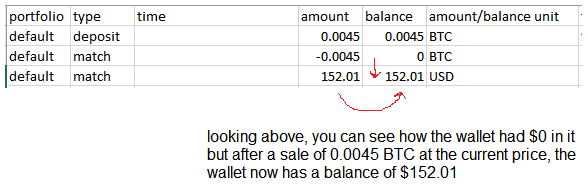

### Processing logic

The account statement CSV tracks your wallet's lifetime so the balance should always end up the same eg. if you expect it to be empty by end of 2022, the transactions will add up to be empty.

The difficulty is the rounding due to amount having decimals as high as 5 places.

The processing of the CSV just goes through and keeps track of what you bought/when and then when selling subtracting against those units in that order eg. FIFO

It is easier if you started with no cryptocurrency at the beginning of the year and none at the end of the year... if you had some from the previous year that has to be accounted for also/first to be sold.
